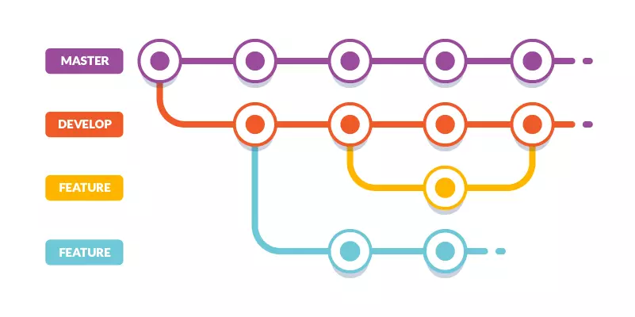

# clase 03 - git desarrollo colaborativo

## Repaso

### Estrategia de ramas basica


## creando una rama

```sh
git branch <nombre-rama>
```

### creando una rama y moverse a la misma

```sh
git branch -c <nombre-rama>
git branch -c feature/footer
```
## listar ramas

```sh
git branch
```

## cambiar de ramas

```sh
git switch <nombre-rama>
```

## toogle entre las 2 ultimas ramas visitadas

```sh
git switch -
```
## borrado de ramas

```sh
git banch -d <nombre-rama>
```
Forzando el borrado con -D
```sh
git banch -D <nombre-rama>
```

### haciendo un merge

nos paramos en main
```sh
git switch main
```

ejecutamos git merge con el nombre de rama con la que queremos mergear. En nuestro caso la rama: feature/branches
```sh
git merge <nombre-rama>
git merge feature/branches
```

### tipos de merge

* fast-foward: todo sale bien y el merge es automatico
* 3 way merge: se crea un commit intermedio y luego se realiza el merge. Sigue siendo automatico
* Merge Conflict: es manual y sucede cuando git no puede inferir con que cambios quedarse.

## clientes de git con GUI

* Github desktop <https://github.com/apps/desktop>

